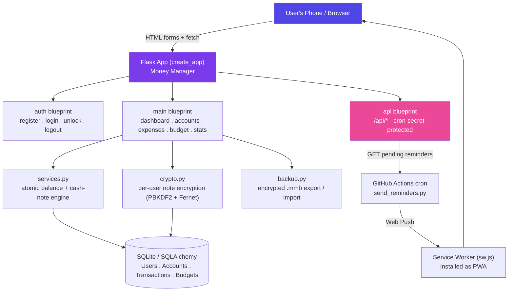

<div align="center">


[](https://git.io/typing-svg)

<p>
  
  
  
  
  
  
</p>
<p>
  
  
  
  
  
</p>
<p>
  
  
</p>

**[🚀 Deployment Guide](./DEPLOY.md)** &nbsp;·&nbsp;
**[🐛 Report an Issue](../../issues)**

</div>


## 📖 Overview

**My Money Manager** is a personal-finance PWA built for a single owner to run their own money-tracking server: a **Flask + SQLAlchemy backend** paired with a **framework-free, mobile-first frontend** that installs to a phone's home screen like a native app.

It isn't just an expense list. Every account (bank, UPI, card, or physical cash) keeps its own live balance, and **cash accounts track individual note denominations** — so "how many ₹500 notes do I actually have in my wallet right now" is always a real, queryable number, not a guess. Transaction notes are **encrypted per-user** with a key derived from the user's own password, so not even direct access to the database file reveals what was written. Recharges and subscriptions get automatic expiry reminders delivered as real push notifications, routed around the free-hosting tier's networking limits via a small GitHub Actions cron job.

> Add money, log an expense split by cash denomination, set a monthly budget, and watch balances, budgets, and note inventories stay perfectly in sync — because every single one of them flows through one atomic service layer.

<div align="center">

|  | 3 | 35 | 9 | 21 | ~2,000 |
|:---:|:---:|:---:|:---:|:---:|:---:|
| | **Blueprints** | **Routes** | **DB Models** | **Templates** | **Lines of Python** |

</div>

---

## 📑 Table of Contents

- [Overview](#-overview)
- [Features](#-features)
  - [Accounts & Cash Tracking](#-accounts--cash-tracking)
  - [Transactions](#-transactions)
  - [Budgets, Statistics & Search](#-budgets-statistics--search)
  - [Security & Encrypted Notes](#-security--encrypted-notes)
  - [Backup & Restore](#-backup--restore)
  - [PWA & Push Reminders](#-pwa--push-reminders)
- [Architecture](#%EF%B8%8F-architecture)
- [Tech Stack](#-tech-stack)
- [Data Model](#-data-model)
- [Project Structure](#-project-structure)
- [Getting Started](#-getting-started)
- [Route Reference](#-route-reference)
- [Security & Reliability](#%EF%B8%8F-security--reliability)
- [Roadmap](#%EF%B8%8F-roadmap)
- [License](#-license)


## ✨ Features

### 💳 Accounts & Cash Tracking

- Unlimited **accounts** of any type — Bank Account, Cash, UPI, Debit Card, Credit Card, Other — each with its own live `balance`, optional last-4-digits label, and an archive (soft-delete) option that preserves history.
- **Cash accounts track physical notes.** Denominations (₹500, 200, 100, 50, 20, 10, 5, 2, 1) are counted, not typed as a total: adding money to a Cash account means tapping how many of each note you're putting in, and the amount is derived automatically from the count.
- Spending Cash records **notes given + change received back**, and the app **blocks a payment that would require more notes of a given denomination than the wallet actually holds** — a live shortage check runs against the current note inventory before the expense is saved.
- A dedicated **cash-holdings editor** lets you do a one-time manual count ("I currently have these notes in hand") to seed the inventory.

### 💸 Transactions

- Two transaction types — **Add Money** (income) and **Add Expense** — both fully editable and deletable, with every edit/delete correctly *reversing* the transaction's old effect on the account balance and note inventory before applying the new one (so nothing can drift out of sync, even across account changes).
- Expenses are organized by **Category → Subcategory** ("Purpose"), seeded on signup with 9 sensible default categories (Food, Transport, Shopping, Education, Health, Technology, Home, Entertainment, Other) and fully editable subcategories loaded dynamically per category.
- Mark any expense as a **recharge / subscription** with a validity period (1 to 365 days); the app computes its expiry date automatically and starts tracking it for reminders.
- A global **search** page matches transactions by amount or (decrypted) note text, plus matching accounts and categories by name.

### 📊 Budgets, Statistics & Search

- One **monthly budget** per calendar month, with live "spent so far vs. budget" shown both on the Add Expense form and the dashboard.
- A **Statistics** page breaks any date range (today / this week / this month / last month / this year / custom) down by category, highlights the single highest expense and top-spending category, computes an average expense, and charts the last 6 months of spending.
- A **Summary** page gives the same range picker with income, expense, and remaining balance rolled up alongside current account balances.

### 🔐 Security & Encrypted Notes

- **Transaction notes are encrypted per-user**, with the encryption key derived (PBKDF2) straight from that user's real login password — the key is **never written to the database**, only held in the signed session cookie for an active login.
- A **"Remember me" auto-login can't rederive that key**, so the app transparently redirects to an **Unlock** screen (re-enter your password) before showing or writing any note in that state — amounts, balances, and categories stay fully visible either way, since only free-text notes are protected.
- Passwords are hashed with Werkzeug's `generate_password_hash` (PBKDF2) — never stored in plain text — and CSRF protection is enabled on every form via Flask-WTF.

### 💾 Backup & Restore

- One-click **encrypted export** of an entire account (accounts, categories, subcategories, transactions, budgets, cash holdings) into a single `.mmb` file, encrypted with a key derived from a password you choose *at export time* — independent of your login password, and never written to disk.
- **Restore** fully validates and decrypts the backup before touching the database, then replaces the current user's data atomically inside one transaction — a bad password or corrupted file changes nothing.

### 📲 PWA & Push Reminders

- Installable as a **home-screen app** on Android (and other platforms) via a web manifest + service worker, with an offline-capable, network-first caching strategy for pages and cache-first for static assets.
- **Recharge/subscription reminders** fire automatically 7 days and 3 days before expiry, and also surface as a badge on the dashboard (red once expired) until dismissed.
- Reminders are delivered as real **Web Push notifications**, routed around PythonAnywhere's free-plan outbound-network restriction by a small **GitHub Actions** cron job (see [Architecture](#%EF%B8%8F-architecture)) that does the actual push-service call once a day.

---

## 🏗️ Architecture

<!--
  Rendered as a static image (via mermaid.ink) instead of a live ```mermaid code block,
  for the same reason as upstream projects: some Git clients / mobile apps don't render
  Mermaid code fences at all. The editable source is kept below if it ever needs updating.
-->
<p align="center">
  
</p>

<details>
<summary>Mermaid source (for editing the diagram)</summary>



> After editing, regenerate the image at [mermaid.live](https://mermaid.live) (Actions → "Copy link to view") and swap it in for the `` above.
</details>

**Why a separate GitHub Actions job for reminders?** PythonAnywhere's free tier whitelists inbound requests fine, but blocks *outbound* calls to arbitrary hosts — which rules out calling Google/Mozilla's push services directly from the server. So the Flask app only ever answers "here's what needs sending" over a normal inbound `GET /api/pending-reminders`; a GitHub Actions workflow (no such restriction) polls that endpoint once a day and does the actual push send, reporting expired subscriptions back for cleanup.

---

## 🧰 Tech Stack

<div align="center">

| Layer | Technology |
|---|---|
| **Backend** |        |
| **Security** |   |
| **Push** |   |
| **Frontend** |     |
| **PWA** |    |
| **Database** |  |
| **Deployment** |   |

</div>

---

## 🗄️ Data Model

| Model | Purpose |
|---|---|
| **User** | Username, optional email, hashed password, per-user `enc_salt` used to derive the note-encryption key. |
| **Account** | A bank/cash/card/UPI account with its own `balance`, `account_type`, optional `last4`, and archive flag. |
| **Category** / **Subcategory** | User-scoped expense categories ("Food") with nested subcategories ("Lunch") used as the expense "Purpose". |
| **Transaction** | A single `income` or `expense` movement — amount, account, category/subcategory, payment method, date, encrypted note, optional `cash_breakdown` JSON. |
| **Budget** | One amount per user per calendar month (`period_key = 'YYYY-MM'`). |
| **CashHolding** | How many notes of each denomination a Cash account currently holds — kept in sync automatically by every transaction that touches it. |
| **Recharge** | Tracks a recharge/subscription's validity window linked to the expense that paid for it; drives the 7-day / 3-day reminder logic. |
| **PushSubscription** | A browser's Web Push subscription (endpoint + keys) for delivering reminder notifications. |

Every query in the app is scoped to `current_user.id`, so one user's accounts, transactions, and notes are never reachable through another user's session.

---

## 📁 Project Structure

```text
my_money_maneger/
├── run.py                        # Local development entry point (python run.py)
├── wsgi.py                       # Production entry point (PythonAnywhere WSGI)
├── config.py                     # Config, default categories, payment methods, cash denominations
├── requirements.txt              # Python dependencies
├── DEPLOY.md                     # Full PythonAnywhere deployment walkthrough
├── .env.example                  # Environment variable template
│
├── app/
│   ├── __init__.py                # App factory - blueprints, security headers, db.create_all()
│   ├── extensions.py               # db / login_manager / csrf singletons
│   ├── models.py                   # SQLAlchemy models (User, Account, Transaction, Budget, ...)
│   ├── services.py                 # Atomic balance + cash-note engine - the single source of truth
│   ├── crypto.py                   # Per-user note encryption (PBKDF2 + Fernet)
│   ├── filters.py                  # Jinja filters: ₹ formatting, percentage, note decryption
│   │
│   ├── auth/
│   │   ├── routes.py                # register . login . unlock . logout
│   │   └── forms.py                 # RegisterForm, LoginForm, UnlockForm
│   │
│   ├── main/
│   │   ├── routes.py                # Dashboard, accounts, categories, transactions, budget, stats, search, settings
│   │   ├── forms.py                 # AccountForm, AddMoneyForm, ExpenseForm, BudgetForm, ...
│   │   ├── utils.py                 # Date-range presets, month keys/labels
│   │   └── backup.py                # Encrypted .mmb export / import
│   │
│   ├── api/
│   │   └── routes.py                # /api/pending-reminders, /api/subscription-cleanup (cron-secret protected)
│   │
│   ├── templates/                  # 21 Jinja templates (dashboard, accounts/, categories/, auth/, ...)
│   └── static/
│       ├── css/style.css            # Dark, mobile-first theme
│       ├── js/app.js                # Cash-denomination counters, subcategory loading, push subscribe
│       ├── manifest.json            # PWA manifest
│       ├── sw.js                    # Service worker - offline cache + push handling
│       └── icons/                   # App icons (192px, 512px)
│
├── github-notifier/
│   ├── send_reminders.py           # Runs on GitHub Actions - sends the actual Web Push
│   └── .github/workflows/send-reminders.yml   # Daily cron trigger
│
└── instance/                       # SQLite database lives here at runtime (gitignored)
```

---

## 🚀 Getting Started

### Prerequisites

- Python **3.10+**
- Any modern browser (push notifications and PWA install require HTTPS in production — PythonAnywhere provides this by default)

### 1 · Clone the repository

```bash
git clone https://github.com/YOUR-USERNAME/my_money_maneger.git
cd my_money_maneger
```

### 2 · Create a virtualenv and install dependencies

```bash
python -m venv venv
source venv/bin/activate        # Windows: venv\Scripts\activate

pip install -r requirements.txt
```

### 3 · Configure environment variables

```bash
cp .env.example .env
```

At minimum, set:

| Variable | Purpose |
|---|---|
| `SECRET_KEY` | Flask session signing - long random string |
| `CRON_SECRET` | Shared secret protecting `/api/pending-reminders` and `/api/subscription-cleanup` |
| `DATABASE_URL` | Defaults to a local SQLite file under `instance/` |
| `VAPID_PUBLIC_KEY` / `VAPID_PRIVATE_KEY` | *(Optional)* Only needed to enable Web Push reminders — generate with `pip install py-vapid && vapid --gen` |

### 4 · Run it locally

```bash
python run.py
```

The app starts on **`http://127.0.0.1:5000`**. Register an account — this automatically seeds the 9 default categories and derives your note-encryption key from the password you just chose.

### 5 · Deploy to production

Full step-by-step instructions (virtualenv, WSGI file, static file mapping, VAPID keys, PWA install, GitHub Actions reminder cron) live in **[DEPLOY.md](./DEPLOY.md)** — the project ships already configured for a PythonAnywhere + GitHub Actions deployment.

---

## 🧭 Route Reference

All routes below require `@login_required` unless noted otherwise. Forms use Flask-WTF CSRF protection; `/api/*` routes use a `CRON_SECRET` query parameter instead, since they're called by an external scheduler with no browser session.

<details>
<summary><b>Auth (<code>/auth</code>)</b></summary>

| Method | Route | Purpose |
|---|---|---|
| `GET/POST` | `/auth/register` | Create an account, seed default categories, derive note-encryption key |
| `GET/POST` | `/auth/login` | Log in, derive note-encryption key for the session |
| `GET/POST` | `/auth/unlock` | Re-enter password to restore the note-encryption key after a "Remember me" login |
| `GET` | `/auth/logout` | Clear the session (including the encryption key) |

</details>

<details>
<summary><b>Core app (<code>/</code>)</b></summary>

| Method | Route | Purpose |
|---|---|---|
| `GET` | `/` | Dashboard — balances, this month's income/expense, recent transactions, recharge alerts |
| `GET` | `/accounts` | List accounts with total balance |
| `GET/POST` | `/accounts/add` | Create an account |
| `GET` | `/accounts/<id>` | Account detail + transaction history (with note search) |
| `GET/POST` | `/accounts/<id>/edit` | Edit an account |
| `POST` | `/accounts/<id>/delete` | Archive (soft-delete) an account |
| `GET/POST` | `/accounts/<id>/cash` | View/set a Cash account's note inventory |
| `GET` | `/accounts/<id>/cash-holdings.json` | Current note counts as JSON (used by the Add Expense form) |
| `GET` | `/categories` | List categories with this month's spend per category |
| `GET/POST` | `/categories/add` | Create a category |
| `GET/POST` | `/categories/<id>` | Category detail, add subcategories, view expenses (with note search) |
| `POST` | `/categories/<id>/delete` | Delete a category (blocked if it has expenses) |
| `GET` | `/subcategories/<id>.json` | Subcategories for a category, as JSON (dependent dropdown) |
| `GET/POST` | `/add-money` | Record income, including counted-cash denominations |
| `GET/POST` | `/add-expense` | Record an expense, including cash given/change and recharge tracking |
| `GET/POST` | `/transactions/<id>/edit` | Edit any transaction (reverses old effect, applies new one) |
| `POST` | `/transactions/<id>/delete` | Delete a transaction (reverses its effect) |
| `POST` | `/recharges/<id>/dismiss` | Dismiss a recharge/subscription reminder |
| `GET/POST` | `/budget` | View/set the current month's budget |
| `GET` | `/statistics` | Category breakdown, top category, 6-month trend for a date range |
| `GET` | `/summary` | Income/expense/remaining + account balances for a date range |
| `GET` | `/search` | Global search across transactions, accounts, categories |
| `GET` | `/backup` | Backup/restore page |
| `POST` | `/backup/export` | Download an encrypted `.mmb` backup |
| `POST` | `/backup/restore` | Restore from an encrypted `.mmb` backup |
| `POST` | `/notifications/subscribe` | Register a Web Push subscription for this browser |
| `POST` | `/notifications/unsubscribe` | Remove a Web Push subscription |
| `GET` | `/settings` | Settings — enable reminders, unlock status |

</details>

<details>
<summary><b>API (<code>/api</code>) — called by the reminder cron, not the browser</b></summary>

| Method | Route | Purpose |
|---|---|---|
| `GET` | `/api/pending-reminders?secret=...` | Returns due 7-day/3-day recharge reminders as push payloads, marks them sent |
| `POST` | `/api/subscription-cleanup?secret=...` | Removes a stale/expired push subscription reported by the sender |
| `GET/POST` | `/api/send-budget-reminders?secret=...` | *(Deprecated on the free tier)* Sends push directly from the server — kept for paid plans with full outbound network access |

</details>

---

## 🛡️ Security & Reliability

- **Notes are end-to-end encrypted per user.** Each note is encrypted with a key derived (PBKDF2-HMAC-SHA256, Fernet/AES) from that specific user's real password. The key only ever lives in the signed session cookie for an active login — it is **never written to the database** — so opening the `.db` file directly, even as the server admin, does not reveal note text without that user's password.
- **"Remember me" can't decrypt notes.** Flask-Login's remember-cookie auto-login doesn't carry the password, so it can't rederive the key; the app prompts to **Unlock** with the password again before showing or creating notes in that state.
- **Amounts, balances, categories and account names are intentionally not encrypted** — they're needed for SQL-level totals (budgets, statistics, dashboards). Only free-text notes are protected.
- **Passwords are hashed** with Werkzeug's `generate_password_hash` (PBKDF2), never stored in plain text.
- **CSRF protection** is enabled on every form via Flask-WTF; the `/api/*` blueprint is explicitly exempted since it's called by an external script with a shared secret, not a browser session.
- **Backups are encrypted independently of login**, using a key derived from a password chosen at export/restore time (PBKDF2-HMAC-SHA256 + Fernet/AES) — no custom crypto, and the password itself is never written to disk.
- **Card/account numbers**: only the last 4 digits are ever stored; CVV/PIN/OTP/full passwords are never collected by this app at all.
- **Strict user scoping** — every account, category, transaction, and budget query is filtered by `current_user.id`, so one user's data is never reachable through another user's session.
- **Baseline security headers** (`X-Content-Type-Options`, `X-Frame-Options`, `Referrer-Policy`) are set on every response.
- **Cash-note integrity checks** — an expense can never claim to hand over more notes of a denomination than the wallet's tracked inventory actually holds.
- **Atomic financial operations** — every balance change, cash-note delta, and budget update happens inside a single database transaction; backup restore validates and decrypts the entire payload before touching the database, so a bad password or corrupted file changes nothing.

---

## 🗺️ Roadmap

- [ ] Multi-currency support for accounts that aren't in ₹
- [ ] Recurring (non-recharge) transactions — rent, salary, subscriptions that aren't tied to an expiry reminder
- [ ] CSV/Excel export alongside the encrypted `.mmb` backup format
- [ ] Shared/family accounts with scoped visibility between multiple users
- [ ] Add `google-generativeai`-style receipt-photo scanning for faster expense entry

---

## 📜 License

This project is intended to be licensed under the **MIT License** — free to use, modify, and distribute, as long as the original copyright and license notice are included.

> **Note:** there's no `LICENSE` file in the repository yet, so this isn't legally binding until one is added. Add a `LICENSE` file with the MIT text at the repo root, then this section can link to it directly.

<div align="center">


© 2026 My Money Manager

</div>
